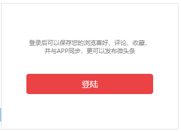

# 头条项目说明

## 一：模块说明

### 1：注册和登录

说明：点击首页"登录"按钮跳转到登录注册页面。

登录成功跳转到首页。此时首页需要显示登录成功后的账户信息和发表的头条信息等。

#### 接口：

| 登录接口 |                                                              |
| :------- | :----------------------------------------------------------- |
| url      | http://tt.linweiqin.com/api/tt/loginCheck                    |
| method   | POST                                                         |
| 参数     | username（用户名）,password（密码）                          |
| 返回数据 |                                                              |
| msg      | 结果信息。                                                   |
| status   | 登录结果。0表示登录成功。100表示账户或者密码错误             |
| wdata    | 用户信息(对象)。avator(头像地址)，article_count(文章数)，tt_count(头条数) |
|          | oauth_token(token字符串)，nickname(用户昵称)，oauth_expire_time(登录时间) |
|          | user_id(用户id)                                              |

| 注册接口 |                                                              |
| :------- | :----------------------------------------------------------- |
| url      | http://tt.linweiqin.com/api/tt/createUser                    |
| method   | POST                                                         |
| 参数     | username（用户名）,password（密码）                          |
| 返回数据 |                                                              |
| msg      | 结果信息。                                                   |
| status   | 登录结果。0表示登录成功。100表示账户或者密码错误             |
| wdata    | 用户信息(字符串)。avator(头像地址)，article_count(文章数)，tt_count(头条数) |
|          | oauth_token(token字符串)，nickname(用户昵称)，oauth_expire_time(登录时间) |
|          | user_id(用户id)                                              |

### 2：用户信息修改

#### 显示用户头条和文章数据

点击主页的用户头像，进入用户文章数据页。点击文章数据页的编辑按钮进入修改用户信息页。

进入用户文章数据页，默认显示微头条数据。

| 获取微头条和文章数据接口 |                                                              |
| :----------------------- | :----------------------------------------------------------- |
| url                      | http://tt.linweiqin.com/api/tt/getArticlesByType             |
| method                   | POST                                                         |
| 参数                     | type (TT请求微头条数据,article请求文章数据), oauth_token(用户token) |
| 返回数据                 |                                                              |
| msg                      | 请求结果文本                                                 |
| status                   | 登录结果。0表示成功。100表示出错                             |
| articles                 | 返回的头条列表或者文章列表. (articles的子字段参照'主页展示新闻列表'的接口说明) |

#### 修改用户信息

点击图片，重新选择一张图片，上传到服务器，获得新的图片的服务器地址。

点击更新资料按钮，把新的昵称和新的服务器地址发送到服务器，得到新的用户数据

记得把新的用户数据和用户头像地址更新到vuex的用户数据内。

| 修改昵称和头像接口 |                                                              |
| :----------------- | :----------------------------------------------------------- |
| url                | http://tt.linweiqin.com/api/tt/updateUserInfo                |
| method             | POST                                                         |
| 参数               | nickname(新昵称), avator(新图片地址), oauth_token(用户token) |
| 返回数据           |                                                              |
| msg                | 请求结果文本                                                 |
| status             | 登录结果。0表示成功。100表示出错                             |
| wdata              | 空字符串                                                     |

鼠标移动到相应文章上,右侧出现删除按钮,点击删除按钮,根据该文章的nid删除该文章.

然后根据该文章在页面上的下标将组件的文章数组内的对应数据删除以更新组件.

| 删除头条或者文章接口 |                                              |
| :------------------- | :------------------------------------------- |
| url                  | http://tt.linweiqin.com/api/tt/deleteArticle |
| method               | POST                                         |
| 参数                 | nid(文章或头条id) , oauth_token(用户token)   |
| 返回数据             |                                              |
| msg                  | 请求结果文本                                 |
| status               | 登录结果。0表示成功。100表示出错             |
| wdata                | 新的用户数据                                 |

#### 修改用户密码

把旧密码和新密码发送到服务器即可,只要旧密码和token正确.

| 修改用户密码接口 |                                                              |
| :--------------- | :----------------------------------------------------------- |
| url              | http://tt.linweiqin.com/api/tt/updatePassword                |
| method           | POST                                                         |
| 参数             | currentPassword(当前密码), updatePassword(新密码), oauth_token(用户token) |
| 返回数据         |                                                              |
| msg              | 请求结果文本                                                 |
| status           | 登录结果。0表示成功。100表示出错                             |
| wdata            | 新的用户数据                                                 |

### 3：主页展示新闻列表

打开首页,展示所有用户的头条数据列表.

所有的数据分成若干页.每次请求数据只能请求其中一页数据,每页数据条数可以设置.

若第一次请求的新闻条数小于总的新闻条数,则每次向下翻请求新一页数据并渲染到页面上.

若显示全了所有数据,继续往下翻,则重复显示最后一页数据.

| 注册接口     |                                                              |
| :----------- | :----------------------------------------------------------- |
| url          | http://tt.linweiqin.com/api/tt/getArticles                   |
| method       | GET                                                          |
| 参数         | lastid(填0), page(第几页数据), number(一页的新闻条数).type(可选TT/Article) |
| 返回数据     |                                                              |
| articles     | 文章列表(数组)                                               |
|              | title(新闻标题)                                              |
|              | content(新闻内容)                                            |
|              | nid(新闻id)                                                  |
|              | created_at(创建时间)                                         |
|              | user(发表新闻的用户信息).  nickname(昵称), avator(头像地址)  |
| counts       | 总共的文章条数.                                              |
| current_page | 当前的页码                                                   |
| status       | 0表示成功,100表示出错                                        |

### 4：发布头条新闻

#### 发布头条新闻

在输入框中输入文字，选择一张图片，点击发布，把文字和图片显示到新闻列表中。

发布内容，可以不选择图片。

发布携带图片逻辑：

选择图片后自动上传到服务器，获取到图片的服务器地址，点击发布按钮，把图片地址作为发布参数传给服务器

上传图片逻辑：

通过ev.target.files获取所有选择的图片，创建formData对象。把图片数据添加到formData对象中，键名叫file。

然后把这个formData对象作为请求参数发送给服务器即完成上传。

| 发布接口 |                                                              |
| :------- | :----------------------------------------------------------- |
| url      | http://tt.linweiqin.com/api/tt/createTT                      |
| method   | POST                                                         |
| 参数     | content(输入框内容), imgs（图片地址，逗号隔开）,oauth_token（用户token字符串） |
| 返回数据 |                                                              |
| msg      | 请求结果文本                                                 |
| status   | 登录结果。0表示成功。100表示出错                             |
| wdata    | 头条id。例如：wdata: "{"nid":853}"                           |

#### 上传图片接口

| 上传图片接口 |                                             |
| :----------- | :------------------------------------------ |
| url          | http://tt.linweiqin.com/api/tt/aliossUpload |
| method       | POST                                        |
| 参数         | ForData数据。这个数据内必须有file键名       |
| 返回数据     |                                             |
| msg          | 请求结果文本                                |
| status       | 登录结果。0表示成功。100表示出错            |
| url          | 图片上传成功后的图片地址                    |

#### 发布头条文章

把富文本框的内容和文章标题发送给服务器.

可以通过v-model获取富文本框内容.

在富文本框中插入图片标签,需要使用自定义的图片事件.具体看课堂例子.

| 发布头条文章接口 |                                                              |
| :--------------- | :----------------------------------------------------------- |
| url              | http://tt.linweiqin.com/api/tt/createArticle                 |
| method           | POST                                                         |
| 参数             | content(富文本) ,img("") ,title(文章标题) ,oauth_token(用户token) |
| 返回数据         |                                                              |
| msg              | 请求结果文本                                                 |
| status           | 登录结果。0表示成功。100表示出错                             |
| wdata            | 文章id.例如:  wdata:"{"nid":854}"                            |

#### 获取文章详情

点击首页文章.跳转到文章详情页.

文章详情页显示文章需要请求服务器并传递文章的nid作为参数,这个参数应该通过点击的文章组件传递给文章详情页.(路由跳转传参)

文章数据的content可能是富文本,需要使用v-html渲染到视图内.

| 获取文章详情接口 |                                                 |
| :--------------- | :---------------------------------------------- |
| url              | http://tt.linweiqin.com/api/tt/getArticleById   |
| method           | POST                                            |
| 参数             | nid(文章id)                                     |
| 返回数据         |                                                 |
| msg              | 请求结果文本                                    |
| status           | 登录结果。0表示成功。100表示出错                |
| article          | 文章数据(对象)                                  |
|                  | content(文章内容,如果是富文本内容,包含图片标签) |
|                  | created_at (创建时间)                           |
|                  | title (文章标题)                                |
|                  | n_user (用户信息)                               |

# 二：项目开发顺序和注意事项

### 确定路由

项目有5个路由（5个页面,5个大组件），分别是：

主页，登录注册页，用户文章列表页，编辑用户信息页，文章详情页。

ps:

可以一开始把所有路由配置好,暂时开发不到的路由组件先给一个静态div.测试路由跳转是否正常.

也可以写一个模块添加一个路由配置.写路由组件功能之前,先测试路由跳转是否正常.

分析路由视图切换时是否需要更新路由组件状态,如何更新.

### 推荐按如下顺序开发。

1.主页模块(先写出静态)

2.登录注册模块(存用户数据到Vuex和本地存储)

3.用户文章列表模块 (根据用户数据的token请求对应的文章列表)

4.编辑用户信息模块 (根据用户呼叫的token修改信息)

5.主页显示文章列表功能 (请求所有新闻数据并渲染,下翻无限渲染)

6.主页点击文章显示文章详情功能 (点击文章跳转到文章详情)

7.主页发布头条和文章模块 (发布文章和头条)

以上每一个步骤遵循vue哲学顺序:

a：根据效果图划分组件

b：根据划分的组件写出静态组件模板，数据写死

c：确定该模块的数据位置。(是否使用共享的Vuex数据,哪些数据需要父传子等等...)

d:  根据数据位置,书写逻辑渲染视图.(反向数据流,操作Vuex数据等等逻辑.)

### 路由守卫

项目中,除了首页和登录页,都需要登录才可以查看.

另外发布按钮也需要登录才可以使用.

### Vuex

本项目的用户信息应该使用Vuex共享.

因为首页,登录页,用户文章详情页,编辑用户信息页都需要使用用户数据中的token字符串进行数据请求.

用户数据由登录模块获得,因此需要在登录成功后存储用户数据到Vuex中.

用户数据还需要存储到本地存储中,方便下次打开页面可以直接浏览用户信息.

### 关于token

各个功能的接口,如果需要发送token,都需要获取用户信息中的token发送给服务器.可以设置axios拦截用于全局配置.

如果过一段时间都没有操作,则可能token会过期导致请求失败.此时服务器返回的结果中的msg会有:token失效的字样.此时应该自动跳转到登录页,要求用户重新登录.

### 关于样式

建议除了首页之外,先不添加过多样式.所有逻辑写完后,再添加样式.想做多美就做多美