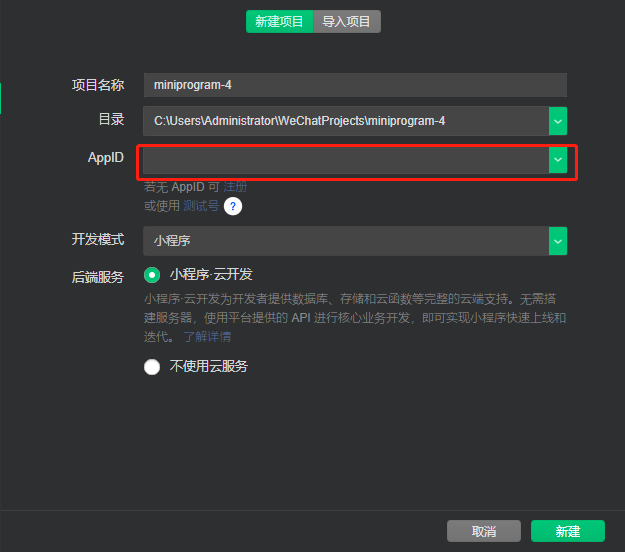

# 小程序基本知识


### 1: 小程序和公众号的区别.

小程序是倾向于功能,公众号倾向于文章展示.


### 2: 注册小程序开发.

平台:微信公众平台 https://mp.weixin.qq.com/

注册: https://mp.weixin.qq.com/wxopen/waregister?action=step1&token=&lang=zh_CN

一个账号需要一个邮箱。一个邮箱注册一个账号。


### 3: 下载开发工具.

下载稳定版:https://developers.weixin.qq.com/miniprogram/dev/devtools/download.html


### 4: 创建项目.

运行微信开发者工具,微信扫码登录,点击创建项目.

这里需要填AppID.才可以创建私人项目.

登录微信公众平台.在左边点击 '开发'.然后再选择 '开发设置',找到AppId.复制




### 5: 小程序项目目录结构

5.1: 小程序有页面的概念.( 路由组件 ). 

页面全都存到pages这个文件夹内.一个page一个子文件夹

每个页面文件夹内有4个文件,分别后缀是.wxml,wxss,js,json.

wxml : 小程序的html文件.小程序的html叫wxml （没有任何原生的html标签，都是自己特有的组件）

wxss : 小程序的css文件.小程序的css叫wxss （绝大部分和原生的css一致）

wxs : 小程序的js.小程序特有的js语法. ( 绝大部分和原生js语法一致 )（默认支持模块化导入导出）

json : 页面的配置文件. 

5.2: 小程序除了页面配置,还有全局配置.

项目根目录下也有 js.wxss.json文件.

app.js : 每个小程序都有一个唯一的app实例. 这个实例通过app.js生成. ( 小程序的最开始运行的文件 )

app.json: 全局配置.

app.wxss : 全局公共样式.


### 6: 全局配置

pages,配置页面.新建文件夹,再右键这个文件夹,选择新建page.操作完成之后.pages选项内多一个页面

默认显示的页面,在所有pege记录是第一条.

window,配置小程序的视口. (很多)


### 7: 官网API

小程序有很多的api,只能一边用一边查.

指南: 类似于教程。（难点的解释）

框架: 主要的功能。

组件: 小程序的标签有哪些。小程序没有html标签，所有的标签都是小程序自定义的。（根ui框架的组件一样）

Api: 所有功能的api文档。


### 8：小程序的组件

小程序没有div，类似的是view标签。

小程序的span标签，用text标签代替。

小程序的a标签，用navigator标签代替。

小程序的图片标签，用image标签代替。

小程序的列表标签，通过嵌套view来实现。


### 9：数据绑定

##### 9.1 绑定内容

就是在标签内通过{{}}来绑定。{{}}内可以写任意表达式。如果数据类似不是字符串，都会隐式转换为字符串

```html
<view>{{0 ? 200 : 300}}</view>
<view>{{0 && '你好'}}</view>
```

##### 9.2 绑定属性

需要写双花括号和引号

```html
<view class='{{cn}}'>11111111</view>
```

绑定事件,不能写{{}},并且事件句柄只能写方法名,不能写其他任意表达式

```html
<!--只能只写一个方法名-->
<button bindtap='fn'>我是一個按鈕</button>

<!--不能这样写一个回调函数在事件后-->
<button bindtap='()=>{console.log(999999)}'>我是一個按鈕</button>
```

小程序事件如何传参?

因为小程序的事件只能写方法名,因此永远无法传参.可以使用变通的方式来实现.

```html
<!-- data-num是button的data-属性,它的值就相当于是实参 -->
<button bindtap='fn' data-num='888'>事件传参</button>

<!-- 在js内可以通过ev.target来获取这个data-num -->
let num = ev.target.dataset.num;
```

事件内this默认指向当前的页面或者组件.
获取页面内数据:

```JavaScript
this.data.数据名
```

获取页面内方法:

```javascript
this.方法名
```

事件对象直接通过形参获取即可.


### 10: 如何实现响应式.

小程序的数据是写在data内的.和Vue类似,data内的数据都是响应式数据.

但是不能直接修改这个数据来达到响应式的效果.

```javascript
// 不能直接修改msg达到响应式效果.
this.data.msg = '我去';

// 只能通过setData来实现响应式.
this.setData({
	msg:'我去'
})
```

如果修改的数据是引用类型,可以不设置一个新的引用.


### 11: 条件渲染

### wx:if

在框架中，使用 `wx:if=""` 来判断是否需要渲染该代码块：

```html
<view wx:if="{{condition}}"> True </view>
```

也可以用 `wx:elif` 和 `wx:else` 来添加一个 else 块：

```html
<view wx:if="{{length > 5}}"> 1 </view>
<view wx:elif="{{length > 2}}"> 2 </view>
<view wx:else> 3 </view>
```

### hidden

```html
<view hidden='{{!flag}}'>2222222222222222222222222</view>
```

wx:if和hidden的区别根Vue的v-if和v-show的区别是一模一样的.

hidden是通过样式来控制显示因此的.不管初始条件是什么,都会渲染标签到视图

wx:if.如果初始条件是false,就什么都不做.不编译模板到虚拟节点中.


### 12: 列表渲染

### wx:for

在组件上使用 `wx:for` 控制属性绑定一个数组，即可使用数组中各项的数据重复渲染该组件。

默认数组的当前项的下标变量名默认为 `index`，数组当前项的变量名默认为 `item`

```html
<view wx:for="{{array}}">
  {{index}}: {{item.message}}
</view>
```

如果想用index和item的别名,可以使用 wx:for-index和 wx:for-item来設置

```html
<view wx:for='{{arr}}' wx:for-index='i' wx:for-item='d'>
  {{i}}-{{d}}
</view>
```

### wx:key

列表渲染的key.可以设置两种值.

1: 字符串. 如果列表项的类型是对象,key的值需要是字符串. 这个值就是列表项的某个key名.值是各不相同,且不会动态改变的键名都可以key.

2: 保留字 *this. 如果列表项的类型是数字或者字符串, 则key的值就是这个 *this.

