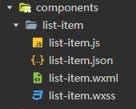

# 小程序组件

### 1：创建组件

1.1. 创建component文件夹,在文件夹内创建一个组件文件文件,再在这个组件文件内创建一个组件

组件也是由4个文件组件. wxml (组件模板template), js (组件的逻辑), wxss (组件样式), json




1.2. 在页面或者组件模板中, 通过组件名字的自定义标签来引入组件.

```html
 <!-- 引入list-item组件 -->
 <list-item />
```

1.3. 在页面或者组件的json配置文件内配置组件名和组件路径

```javascript
{
  "usingComponents": {
    "list-item":"../../components/list-item/list-item"
  }
}
```

1.4. 组件的选项常用的有data,properties,methods

```javascript
Component({
  /**
   * 组件父传子的数据列表,Page没有properties选项.组件Component有这个选项
   */
  properties: {},

  /**
   * 组件的初始数据
   */
  data: {},

  /**
   * 组件的方法列表,注意,Page没有methods选项.组件Component有这个选项
   */
  methods: {}
})
```


### 2：组件通信

##### 2.1. 父传子

2.1.1 在父组件中通过组件标签给子组件传递数据. (前子后父)

```javascript
 <!-- 把父组件的msg传递给子组件的str -->
 <list-item str='{{msg}}' />
```

2.1.2 子组件通过properties来注册str。

```javascript
properties: {
	// 只有一个type选项的简写
    str:String
    // value选项指的是默认值
    str:{
       type:String,
       value:'str的默认值'
    }
},
```

2.1.3 Vue和React都不能在子组件中修改父组件的props数据.为了防止在组件内修改了父组件的状态.

小程序可以修改父组件传递的properties,但是父组件的状态不会改变.

##### 2.2  子传父

2.2.1 父组件创建一个方法用于接收子组件数据

```javascript
// ev.detail就是子组件传递的数据.
getMsg(ev){
    this.setData({
      str:ev.detail
    })
 },
```

2.2.2 子组件绑定自定义事件myevent，这个自定义事件的事件句柄就是getMsg

```html
<!--通过bind来添加自定义事件myevent-->
<list-item bindmyevent='getMsg' />
```

2.2.3 子组件通过triggerEvent触发myevent事件,并且传递子组件的数据给myevent的事件句柄getMsg

```javascript
sandMsg(){
    this.triggerEvent('myevent',this.data.msg);
}
```

##### 2.3 反向数据流

2.3.1 修改数据的方法写在父组件上.

```javascript
  del(ev){
    let i = ev.target.dataset.i;
    this.data.arr.splice(i,1);
    this.setData({
      arr:[...this.data.arr]
    })
  },
```

2.3.2 子组件添加自定义事件myevent.这个自定义事件的事件句柄就是del方法

```html
 <block wx:for="{{arr}}" wx:key='*this'>
    <list-item bindmyevent='del' item='{{item}}' data-i='{{index}}'  />
  </block>
```

2.3.3 子组件内通过triggerEvent方法触发自定义事件myevent.

```javascript
 del(){
     this.triggerEvent('myevent');
 }
```


### 3：插槽

##### 3.1 使用插槽

3.1.1 在子组件的自定义标签的内容中插入任意的节点.(文本,标签,组件)

```html
<!-- <text>插槽的文本内22222</text> 就是组件children的插槽内容-->
<children>  
    <text>插槽的文本内22222</text>
</children> 
```

3.1.2 在组件中通过<slot /> 来引入插槽到组件模板内.

```html
<!-- <slot />在渲染时,会被插槽内容替换掉 -->
<view>
  <view>children组件</view>
  <slot />
</view>
```

3.1.3 具名插槽

如果有多个插槽,并且需要对号入座插入到指定的位置,需要给插槽起名字.

```html
<!-- 通过slot属性来给插槽起名字 -->
<children>  
    <text slot='a'>插槽的文本内11111</text>
    <text slot='b'>插槽的文本内22222</text>
</children>  
```

3.1.4 组件内使用具名插槽

```html
<view>
  <slot name='b' />
  <view>children组件</view>
  <slot name='a' />
</view>
```

3.1.4 使用具名插槽的组件,需要配置options选项

```javascript
// 在children组件内需要配置options选项,并且设置multipleSlots为true
Component({
  options:{
    multipleSlots:true
  },
 })
```

##### 3.2 插槽解决多层父子传值,以及父子解耦后的传值问题

3.2.1 多层传值.用插槽把所有的子孙组件的组件引入都写在父组件中.

这样就可以直接将父组件的数据传递给需要的任意子孙组件.

```html
<!-- box组件作为list-item的插槽 -->
<block wx:for="{{arr}}" wx:key='*this'>
    <list-item bindmyevent='del' item='{{item}}' data-i='{{index}}'>
      <box str='{{msg}}' />
    </list-item>
</block>
```

3.2.2. 利用插槽进行多层传值之后.如何进行子孙间数据的传递?

例如以上问题,list-item组件,如何传递数据给box组件?

要解决这个问题,解耦后的两个组件都需要设置relations选项.

relations内的linked钩子函数的形参,就是对应的组件.

list-item需要设置box组件是其子组件

```javascript
 // list-item需要设置它和box组件的关系
//  这里linked内的形参box,就是box组件.
 relations:{
     '../box/box':{
         type:'child',
         linked(box){
             box.setData({
             	msg:this.data.msg
             })
         }
     }
 },
```

box组件需要设置list-item组件是其父组件.

```javascript
// box组件设置list-item组件是其父组件 
// 这里linked函数的形参item,就是item组件
relations:{
    '../item/item':{
      type:'parent',
      linked(item){}
    }
 },
```


### 4：组件混合 （behaviors）

小程序组件通过behaviors来进行组件混合。

例如item组件和box组件都有一个像他的data选项。可以通过behaviors来进行复用。

把data选项写成一个单独的模块。

```javascript
// 在behoviors模块中,需要导出Behavior(config)
// config内就是需要复用的选项

export default Behavior({
  data: {
    msg:'behaviors内的数据'
  },
})
```

item组件和box组件都需要引入behaviors模块,然后通过选项behaviors引入复用的data选项

```javascript
import mx from '../behaviors/index.js'
Component({
	behaviors:[mx]
})
```

如果behaviors内的选项和组件内的选项有冲突,以组件的选项为准.


### 5：watch和计算属性

小程序组件通过observers来监听组件的数据变化。

```javascript
observers:{
    // 监听一个num数据
    'num'(){console.log('num发生了变化')},
    // 监听一个数组的第二个元素
    'arr[1]'(){},
    // 监听obj的name属性
    'obj.name'(){},
    // 深度监听所有obj的子字段
    'obj.**'(){},
    // 同时监听两个数据 (类似于Vue的计算属性)
    'count,price'(){}
},
```

小程序的计算属性可以通过同时监听多个数据来实现.

例如,单价 * 数量的计算属性逻辑.

```javascript
observers:{
    // 当count和price变化时,重新计算total的值.
    'count,price'(){
      this.setData({
        total:this.data.count * this.data.price
      })
    }
},
```


### 6：生命周期

小程序的生命周期分为组件的生命周期和页面的生命周期。

##### 6.1 组件的生命周期

6.1.1 组件的生命周期有5个钩子函数。

分别是，created，attached，ready，moved，detached

创建阶段：

​	created （给组件添加一些自定义字段，类似于React的constructor，这里不能调用setData），

​	attached （ 对数据进行初始化操作，用法类似于Vue的created ），

​	ready（类似于Vue的mounted，挂载后）

运行阶段：

​	moved （组件节点位移是触发），

​	detached （ 组件从页面节点树中移除时触发，退出页面也触发 ）

所有的组件生命周期都可以写在lifetimes内部。

```javascript
  lifetimes:{
    created(){
      console.log('created')
    },
    attached(){
      console.log('attached')
    },
    ready(){
      console.log('ready')
    },
    detached(){
      console.log('组件被移除')
    }
  },
```

##### 6.2 页面的生命周期

页面的生命周期有4个.分别是 onLoad，onShow，onReady，onHide，onUnload

创建阶段：onLoad（页面第一次创建），onShow（），onReady （页面挂载）

运行阶段：onShow （显示当前页面），onHide（隐藏当前页面），onUnload （销毁页面）


